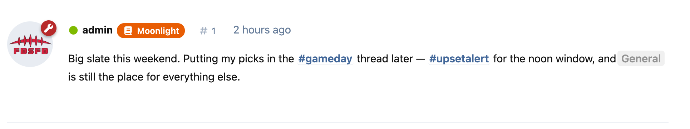
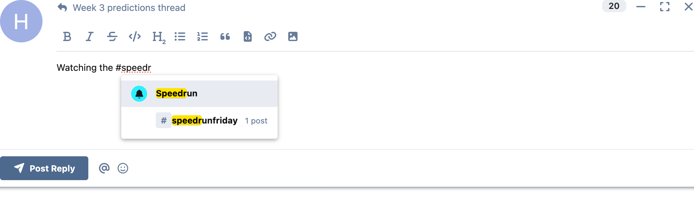
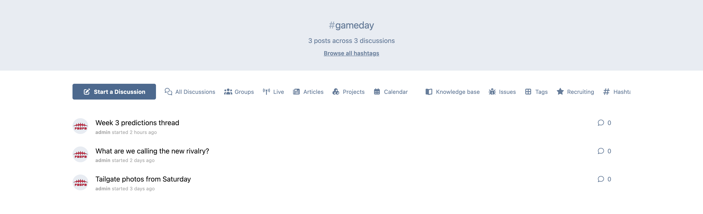
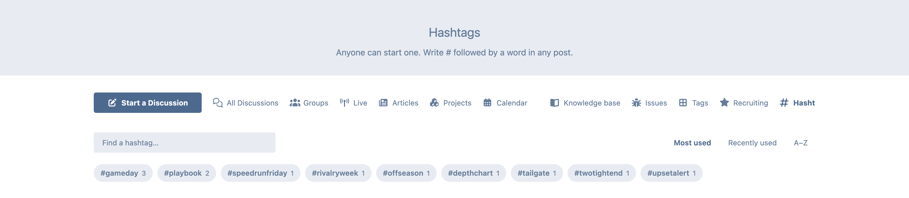

# Hashtags

**Freeform hashtags for Flarum 2.** Write `#anything` in a post and it becomes a link to a feed of every discussion using it. No admin setup, no pre-created tags, nothing to configure — if someone types it, it exists.



That screenshot is the whole design in one line. `#gameday` and `#upsetalert` are freeform hashtags that nobody created in advance. `General` is a real Flarum tag, and it still renders as a tag mention. Both use `#`, in the same sentence, and neither gets in the other's way.

---

## Contents

- [Why this isn't a conflict with tag mentions](#why-this-isnt-a-conflict-with-tag-mentions)
- [What gets matched, and what doesn't](#what-gets-matched-and-what-doesnt)
- [Case](#case)
- [Composer autocomplete](#composer-autocomplete)
- [Pages and search](#pages-and-search)
- [Installing](#installing)
- [Installing on a forum that already has posts](#installing-on-a-forum-that-already-has-posts)
- [Permissions and privacy](#permissions-and-privacy)
- [For developers](#for-developers)
- [Licence](#licence)

---

## Why this isn't a conflict with tag mentions

`flarum/mentions` already uses `#` — `#general` links to the tag with that slug. The obvious assumption is that a hashtag extension has to fight it: patch it, disable it, or move one of the two onto a different symbol.

It doesn't. **This extension does not touch `flarum/mentions` at all.** Both matchers are registered, and which one wins is decided by position in the text:

| You write | A tag with that slug exists | No such tag |
|---|---|---|
| `#general` | tag mention → `/t/general` | freeform hashtag → `/hashtag/general` |
| `#foryourpage` | — | freeform hashtag → `/hashtag/foryourpage` |

Core's tag-mention pattern opens with `(?:[^“"]|^)`, so it consumes the character *before* the `#`. Its tag therefore begins one byte earlier in the text than ours does, and s9e/TextFormatter sorts pending tags by position — so the tag mention is always offered the text first.

- If the slug resolves to a real tag, the mention is applied and the parser cursor advances past `#slug`. Our tag is then behind the cursor and is discarded. **The tag wins, as it should.**
- If the slug is not a tag, `addTagId` never sets `id` or `tagname`. Both are required attributes, so `filterAttributes` invalidates the tag. An invalidated tag does not advance the cursor, so `HASHTAG` is offered the same text next and claims it.

Because precedence is **positional**, it does not depend on extension load order, and it does not depend on `sortPriority` — which matters, because the Preg plugin hardcodes `-100` for every matcher it registers, so priority isn't available as a lever to anyone.

The practical consequence: **a tag slug is never shadowed by a hashtag, and a hashtag never has to be registered in advance.** If an admin later creates a tag whose slug matches an existing hashtag, `#that` starts resolving to the tag from the next post onward. Older posts keep the link they were parsed with until they're edited.

## What gets matched, and what doesn't

The pattern is `\B#` followed by at least one letter, up to 59 characters of letters, numbers, marks, `-` and `_`.

**Matched:** `#gameday` · `#GameDay` · `#multi-word-thing` · `#two_words` · `#café` · `#日本語` · `#abc123`

**Not matched:**

| Input | Why |
|---|---|
| `C#`, `F#`, `foo#bar` | `\B#` requires the `#` not be preceded by a word character |
| `#42` | at least one letter is required, so issue-reference extensions keep `#123` |
| `# Heading` | Markdown headings have a space |
| `` `#gameday` `` | code spans, fenced blocks and indented blocks are left alone |
| `example.com/page#gameday` | the URL tag starts earlier and runs longer, so it wins |
| a 60+ character word | there is no word boundary to close on, so it simply isn't a hashtag |

All of the above are verified against Litedown (`flarum/markdown`) and Autolink with both extensions enabled.

## Case

**Matching is case-insensitive. Display is not.**

`#GameDay` and `#gameday` are one hashtag with one feed. Each post renders the casing its author typed, and the canonical URL uses the folded form, so there is exactly one URL per hashtag. The browse page and autocomplete show the casing of whoever used it first.

## Composer autocomplete

If `flarum/mentions` is installed, typing `#` in the composer offers existing hashtags **and** tags in a single dropdown:



That's `#speedr` matching both the **Speedrun** tag and the **#speedrunfriday** hashtag. This extension registers onto core's existing `HashMentionFormat` rather than adding a competing trigger, so there is one `#` and one list.

This is not a nicety — it is what makes freeform hashtags work at all. Without suggestions you get `#gameday`, `#GameDay` and `#game-day` as three separate feeds inside a week, because nobody can see what already exists while they're typing. Convergence is the entire value of a freeform namespace.

Without `flarum/mentions`, everything still parses, links and browses. You just lose the suggestions.

## Pages and search

**`/hashtag/:name`** — every discussion containing a post that used a hashtag.



This is a stock `DiscussionList` driven by a `hashtag:` search filter, which means visibility scoping, pagination and the sort dropdown are core's own, not a reimplementation. A hashtag used only inside discussions you can't see gives you an empty feed.

**`/hashtags`** — browse everything currently in use, with search and popular / recently used / A–Z.



Both are linked from the forum's index navigation. The filter also works in the search box directly:

```
hashtag:gameday       discussions using it
-hashtag:gameday      discussions not using it
```

## Installing

Run this **from your Flarum directory** — the one containing `flarum`, `config.php` and `composer.json`:

```bash
composer require ernestdefoe/hashtags
php flarum cache:clear
```

To update later, `composer update ernestdefoe/hashtags` from the same place.

<details>
<summary>“Your requirements could not be resolved… does not match your minimum-stability”</summary>

If the output also says `./composer.json has been created`, Composer was run somewhere that isn't a Flarum install. It made an empty project, which defaults to `minimum-stability: stable`, and Flarum 2 is still published as `rc` — so nothing resolves.

`cd` to your Flarum directory and run it again. A real Flarum root already requires `flarum/core: ^2.0.0-rc.1`, and an explicit pre-release constraint is honoured whatever `minimum-stability` says.

</details>

Requires **Flarum 2.0+** and **PHP 8.3+** (the floor `flarum/core` itself sets). `flarum/tags` and `flarum/mentions` are both optional — the extension works without either, and integrates with both when present.

There is nothing to configure. Hashtags are freeform by design, so there are no settings that wouldn't contradict the post text that created them.

## Installing on a forum that already has posts

Flarum stores posts as **parsed XML**, not as source text. A post written before this extension existed has `#gameday` sitting in a plain text node with no hashtag element in it — so it will never render as a link or appear in a feed, however many times the page is reloaded. Re-parsing is the only thing that changes that, and re-parsing is exactly what happens when someone edits a post.

To do it in bulk:

```bash
php flarum hashtags:reindex --dry-run   # report what would change, write nothing
php flarum hashtags:reindex             # do it
```

Only posts that actually contain a hashtag are ever rewritten. The command filters twice before touching anything — first a SQL filter for posts whose stored content contains a `#` at all, then a regex check against the unparsed source — so on a typical forum a low single-digit percentage of posts are written and everything else is read and skipped.

It is idempotent: a second run reports `0 updated`. Use `--chunk` to change the batch size (default 500).

## Permissions and privacy

Hashtag **rows** are visible to everyone — a hashtag is a word, not content. What a hashtag *leads to* is scoped per actor by Flarum's own discussion search, so a hashtag used only in a private discussion appears in the list but its feed comes back empty for anyone who can't see the discussion.

That is a deliberate trade: it reveals that a word has been used somewhere, never a discussion, a title or an author. If your forum needs the stricter behaviour, the place to change it is `HashtagSearcher::getQuery()`.

Hidden posts contribute nothing. Hiding a post retracts its hashtags and restoring reinstates them; deleting a post removes its rows and corrects the counts.

## For developers

| Piece | Where |
|---|---|
| Tag registration and the pattern | `src/Formatter/ConfigureHashtags.php` |
| Extraction, case folding, counters | `src/Hashtag/HashtagSyncer.php` |
| `hashtag:` discussion filter | `src/Search/Filter/HashtagFilter.php` |
| `GET /api/hashtags` | `src/Api/Resource/HashtagResource.php` |
| Backfill | `src/Console/ReindexCommand.php` |
| Autocomplete registration | `js/src/forum/mentionables/HashtagMention.tsx` |

Two tables: `hashtags` (one row per distinct hashtag, keyed on a case-folded `name_key`) and `post_hashtag` (which posts use which, with `discussion_id` denormalised so the feed is one indexed subquery).

Counters are **recomputed** from the pivot on every sync rather than incremented. An aggregate over a narrow index can't drift; a counter that is incremented on save and decremented on delete drifts the first time a queued job is retried or a row disappears through a foreign-key cascade, which fires no Flarum event.

The API resource is read-only on purpose. Hashtags come into being by being written in a post and stop existing when the last post using one is edited or deleted — an admin "editing" a hashtag would immediately disagree with the text that produced it.

## Licence

[MIT](LICENSE.md) © Ernestdefoe

Bug reports: [ernestdefoe.online/t/hashtags](https://ernestdefoe.online/t/hashtags)
